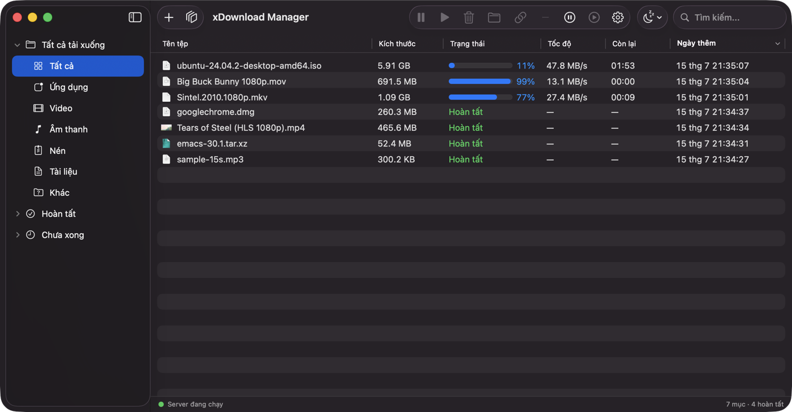
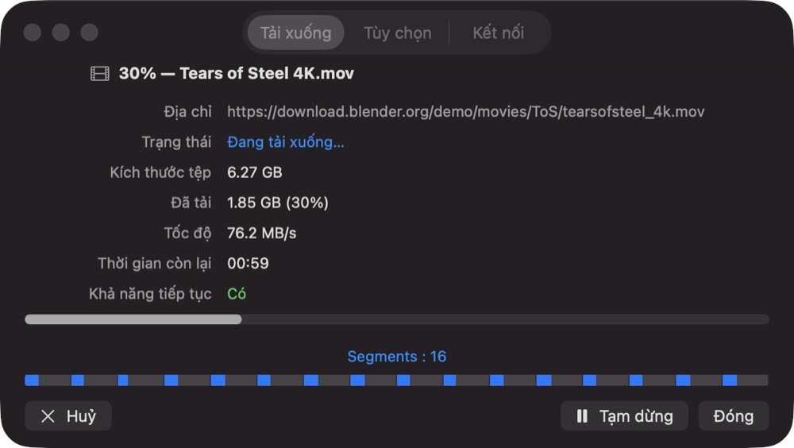
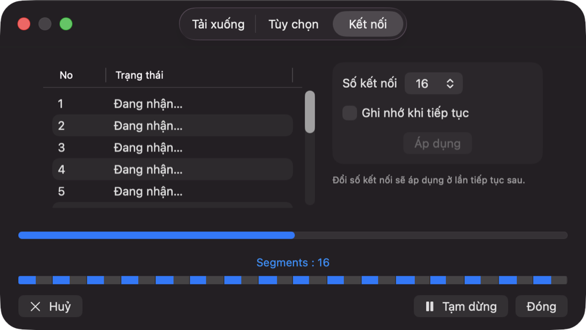
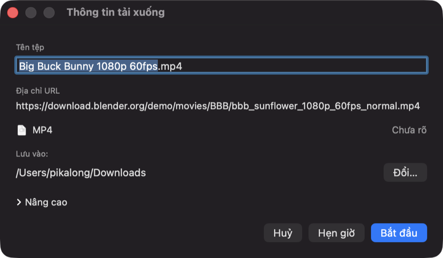
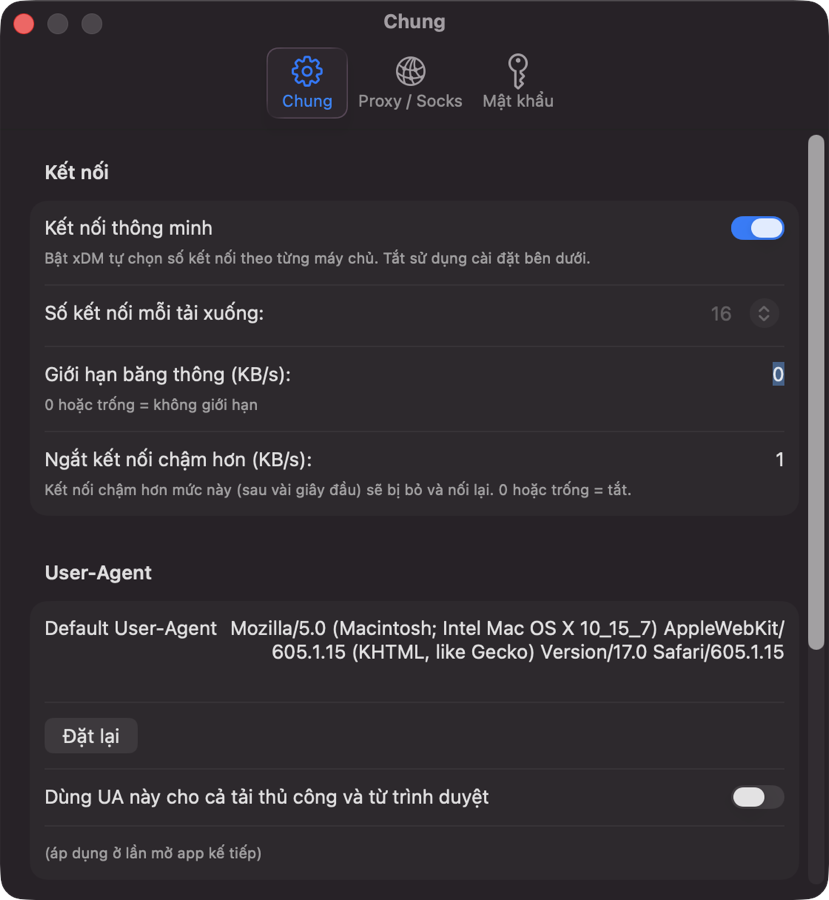

# xDownload Manager

**Trình quản lý tải xuống hiệu suất cao cho macOS** — tải file đa kết nối, tải video HLS về sẵn `.mp4`, và bắt link trực tiếp từ trình duyệt qua extension.

[](../../releases/latest)



---

## ✨ Tính năng nổi bật

### 🚀 Tải đa kết nối, nhanh hết băng thông

Mỗi file được chia thành nhiều đoạn theo HTTP Range và tải song song bằng **16 kết nối** (tuỳ chỉnh 1–32). Vì CDN thường bóp tốc độ theo **từng kết nối** chứ không theo tổng, mở nhiều kết nối cho tốc độ tăng gần như tuyến tính — thực tế đạt **~100 MB/s** trên đường truyền đủ nhanh.

- **Kết nối thông minh**: app tự chọn số kết nối phù hợp cho từng máy chủ, không cần chỉnh tay.
- **Work-stealing**: kết nối nào xong sớm sẽ nhảy vào giúp phần còn lại, không để kết nối nào rảnh.
- **Ngắt kết nối chậm**: kết nối tụt dưới ngưỡng sẽ bị bỏ và nối lại.
- Tự động lùi về 1 luồng nếu máy chủ không hỗ trợ Range.



### ⏸️ Tạm dừng / tiếp tục an toàn tuyệt đối

Dừng giữa chừng, tắt app, mở lại hôm sau — tải tiếp đúng từ byte đang dở.

- Checksum **FNV-1a** kiểm theo từng byte, **fsync trước mỗi checkpoint**.
- Khi tiếp tục, app **đọc lại byte thật trên đĩa để verify** — không bao giờ có file "hoàn tất nhưng hỏng".
- File tải vào thư mục tạm, **chỉ khi hoàn chỉnh mới chuyển ra thư mục đích**.

### 🎬 Tải video HLS → `.mp4`

Dán link `.m3u8` (hoặc để extension bắt hộ), app trả về file `.mp4` xem được ngay.

- **ffmpeg đóng gói sẵn** trong app — không cần cài gì thêm.
- Hỗ trợ cả **MPEG-TS (.ts)** và **fragmented-MP4 (.m4s / CMAF)**.
- **Giải mã AES-128** tự động.
- Tải song song các segment, **tiếp tục được từ chỗ dừng**, hiển thị tiến trình ghép tệp thật.

### 🔗 Extension Chrome bắt link tự động

- Nhận diện video/media trên trang, kể cả **HLS ẩn trong MSE/blob** (hook `fetch` / `XHR` / `createObjectURL`).
- Hiện nút **"Tải video"** nổi ngay trên thẻ `<video>`, kèm **menu chuột phải**.
- Master playlist được tách thành **dropdown chọn chất lượng** (480p / 720p / 1080p…).
- Gửi link về app qua HTTP cục bộ có **token CSRF**, server chỉ lắng nghe trên `127.0.0.1` — trang web không đọc được token nên không thể tự thêm link vào app.

### 🖥️ Giao diện gọn, đúng chất macOS

- **Sidebar lọc** theo Tất cả / Hoàn tất / Chưa xong và theo loại: Ứng dụng, Video, Âm thanh, Nén, Tài liệu…
- **Bảng nhiều cột sắp xếp được**: tên, kích thước, trạng thái, tốc độ, thời gian còn lại, ngày thêm.
- **Cửa sổ chi tiết**: thanh segment trực quan + bảng trạng thái từng kết nối, đổi số kết nối ngay tại chỗ.
- Tốc độ được **làm mượt bằng EMA** nên không nhảy giật.
- **Tìm kiếm nhanh** toàn danh sách.



### 🕹️ Thêm link kiểu nào cũng được

Kéo & thả URL vào app, dán bằng `Cmd+V`, bấm nút **+**, hoặc để extension đẩy sang. Trước khi tải, app cho bạn sửa tên tệp, chọn thư mục lưu, hoặc **hẹn giờ** tải sau.



### ⚙️ Tuỳ chỉnh & chạy nền

- **Proxy** HTTP / SOCKS v4/v5, **xác thực** Basic / Digest (mật khẩu lưu trong Keychain).
- **User-Agent tuỳ chỉnh**, **giới hạn băng thông** riêng cho app.
- **Biểu tượng trên menu bar**; đóng cửa sổ app vẫn tải tiếp, có thể ẩn khỏi Dock.
- **Khởi động cùng hệ thống** (bật sẵn).



---

## 📦 Cài đặt

1. Tải file `.dmg` mới nhất ở mục **[Releases](../../releases/latest)**.
2. Mở `.dmg`, kéo **xDownload Manager** vào thư mục **Applications**.
3. Lần đầu mở, nếu macOS báo *"bị hỏng"* hoặc *"không xác minh được nhà phát triển"* (app chưa notarize), chạy lệnh sau trong Terminal rồi mở lại:

   ```bash
   xattr -cr "/Applications/xDownload Manager.app"
   ```

   Hoặc: chuột phải vào app → **Mở**.

### Yêu cầu

- macOS 14+ (Apple Silicon / Intel)
- Không cần quyền admin, không cần cài ffmpeg

---

## 🧩 Cài extension cho Chrome

1. Mở `chrome://extensions` → bật **Developer mode** (góc phải trên).
2. Bấm **Load unpacked** → chọn thư mục `extension/`.
3. **Chạy app trước**, rồi ghé trang có video: nút **"Tải video"** sẽ hiện trên trình phát.

> ⚠️ App phải đang chạy thì extension mới gửi link được (cổng `127.0.0.1:10008`).

---

## ⚠️ Hạn chế

- Không hỗ trợ YouTube / yt-dlp.
- Không hỗ trợ video DRM (SAMPLE-AES, CENC).
- Extension chỉ hoạt động khi app đang chạy.

---

## 📝 Ghi chú

- Dữ liệu app lưu ở `~/Library/Application Support/xDownloadManager/`
- Lịch sử tải và cài đặt được lưu tự động.

---

*Developed with ❤️ by LQ Team*
